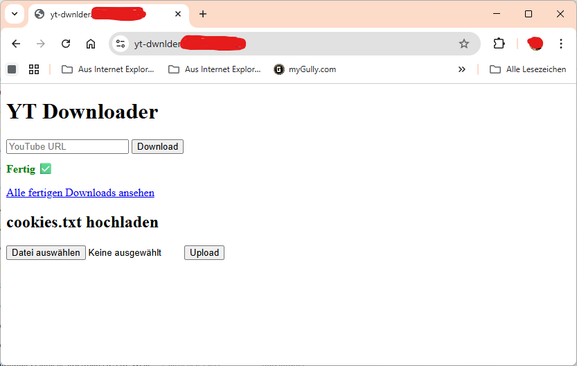
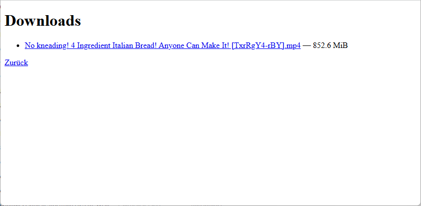

# youtube-downloader-docker

Simple self-hosted YouTube downloader with web interface using **Docker, Flask, yt-dlp and ffmpeg**.

The application provides a lightweight browser interface where you can paste a video URL, download it using **yt-dlp**, and automatically convert the result to **MP4**.

---

## Screenshots

### Web Interface

### Download Status

---

## Features

- Download YouTube videos via web interface
- Uses **yt-dlp** for high quality downloads
- Automatic **webm/mkv → mp4 conversion**
- Optional **cookies.txt support**
- Host-mounted download directory
- Simple Docker deployment
- No external dependencies besides Docker

---

## Architecture

Current runtime:

Browser  
↓  
Flask Web UI  
↓  
yt-dlp  
↓  
ffmpeg (auto convert to MP4)  
↓  
Local storage

---

## Quick Start

Clone the repository:

git clone https://github.com/marcusspahn/youtube-downloader-docker.git  
cd youtube-downloader-docker

Start the container:

docker compose up -d --build

Open the web interface:

http://YOUR-SERVER-IP:8099

---

## Docker Setup

The container runs a Flask backend on port **8099**.

Persistent directories:

./downloads → /downloads  
./cookies → /cookies

Downloaded videos will appear in the **downloads** folder.

---

## Cookie Support (optional)

Some platforms require authentication.

You can upload a cookies.txt file via the web interface or place it here:

cookies/cookies.txt

The downloader will automatically use it if present.

---

## Project Status

The repository also contains a separate nginx frontend in the `frontend/` folder.

This is currently experimental and not active in docker-compose.

The active interface is the Flask UI served by the backend container.

---

## Disclaimer

This project is intended for self-hosted personal use.

Users are responsible for respecting the terms of service and copyright laws of the platforms they download from.

---

## License

MIT License
